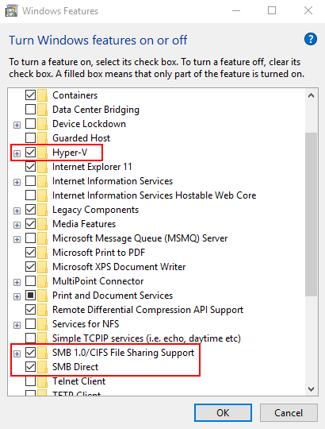
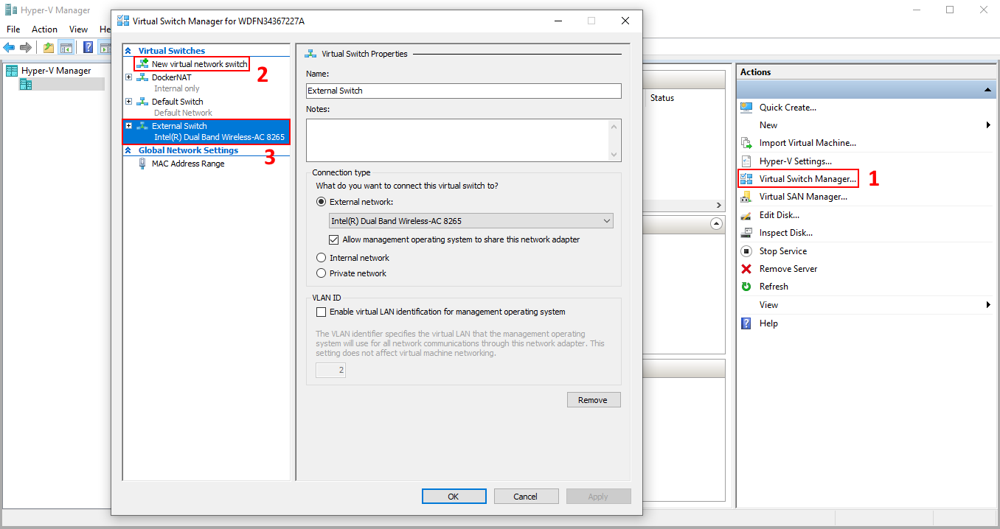

# Vagrant Virtual Machines Collection

A repository that contains all of my common virtual machines.

1. [Machines](#machines)
1. [Vagrant Installation](#installation)
1. [Additional Setup](#additional-setup)
    1. [Windows](#windows-10)
1. [Launching A Virtual Machine](#launching-a-virtual-machine)

## Machines

- **Ubuntu-XFCE**: Machine that runs Ubuntu with XFCE 4 as a desktop environment

## Installation

You can find the official guide [here](https://www.vagrantup.com/docs/installation/).

### Linux

- Install `vagrant` by running `install.sh`
- Install a provider, `VirtualBox` is the preferred option

### Windows

- Go to the [download page](https://www.vagrantup.com/downloads.html) and download the newest version for 64 bit.
- Install `vagrant` with the `.msi` you just downloaded
- Follow the additional setup steps for Windows

## Additional Setup

#### Windows 10

Install the vagrant vb-guest plugin:

```sh
vagrant plugin install vagrant-vbguest
```

Open a powershell and run:

```sh
bcdedit /set hypervisorlaunchtype auto
```

Make sure that `Hyper-V` and `SMB Direct` is enabled:

- Go to `Settings > Apps & Features > Programs and Features > Turn Windows features on or off`
- Make sure that `Hyper-V` and `SMB Direct` is enabled:
  

Add an external switch to Hyper-V

- Start Hyper-V manager
- Open the `Virtual Switch Manager` (1)
- Add `New virtual network switch`, `external` type (2)
- Make sure the `Virtual Switch` is set up correctly (3)



**Reboot your machine!**

## Launching a virtual machine

### Linux

- Open a shell and navigate to the folder of the desired machine
- `vagrant up`

### Windows

- Open an Administrator prompt and navigate to the folder of the desired machine
- `vagrant up --provider=hyperv` (Provider does not have to be specified if there are no other options)
- When asked for the selection of a virtual switch, choose `External Switch` (was created in [additional setup](#windows-10))
- When asked for entering the username and password to share the folder, enter your Windows username (without domain) and password

If you want to use the GUI of the machine, open `Hyper-V Manager` and click `Connect`.
